# Referral System - Frontend

A modern, responsive frontend application for the Referral System built with React. This application provides a seamless user interface for managing referrals, purchasing courses, and tracking credit rewards.

## 📋 Table of Contents

- [Features](#-features)
- [Tech Stack](#-tech-stack)
- [System Architecture](#-system-architecture)
- [Getting Started](#-getting-started)
- [Environment Variables](#-environment-variables)
- [Installation](#-installation)
- [Available Scripts](#-available-scripts)
- [Server Repository](#-server-repository)

## ✨ Features

- **User Authentication**: Secure login and registration with JWT
- **Referral Dashboard**: Track referrals, conversions, and earned credits
- **Course Marketplace**: Browse and purchase available courses
- **Referral Code Sharing**: Generate and share unique referral links
- **Real-time Statistics**: View referral performance metrics
- **Admin Panel**: Course management for Super Admin users
- **Responsive Design**: Optimized for desktop, tablet, and mobile devices

## 🛠️ Tech Stack

- **Next.js** - UI Framework
- **TypeScript** - Type safety
- **Tailwind CSS** - Styling
- **Axios** - HTTP client
- **RTK Query** - Data fetching and caching
- **Redux Toolkit** - State management

## 🏗️ System Architecture

### UML Diagram

The complete system flow and user interactions:



### Database Schema

Backend database structure and relationships:


## 🚀 Getting Started

### Prerequisites

- Node.js >= 22.x
- yarn or npm
- Running backend server (see [Server Repository](#-server-repository))

## 🔐 Environment Variables

Create a `.env` file in the root directory:

```env
# API Configuration
NEXT_PUBLIC_DOMAIN=http://localhost:3000
NEXT_PUBLIC_BASE_API_URL=http://localhost:5000/api/v1

```

## 📦 Installation

```bash
# Clone the repository
git clone https://github.com/tusharahmmed/referral-client.git

# Navigate to project directory
cd referral-client

# Install dependencies
yarn install

# Copy environment variables
cp .env.example .env

# Configure your .env file with API settings

# Start development server
yarn dev
```

The application will be available at `http://localhost:3000`

## 📜 Available Scripts

```bash
# Start development server
yarn dev

# Build for production
yarn build

# Start production server
yarn start

```

## 🔗 Server Repository

This frontend connects to the Referral System backend API.

**Backend Repository**: [https://github.com/tusharahmmed/referral-server](https://github.com/tusharahmmed/referral-server)

### Server Details

- **API Base URL**: `http://localhost:3000/api`
- **API Documentation**: `http://localhost:3000/api-docs`
- **Tech Stack**: Node.js, Express, TypeScript, MongoDB
- **Authentication**: JWT with refresh tokens

**Built with ❤️ using Next.js, TypeScript, and Tailwind CSS**
